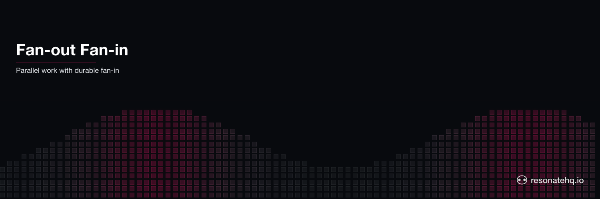

<p align="center">
  <picture>
    <source media="(prefers-color-scheme: dark)" srcset="./assets/banner-dark.png">
    <source media="(prefers-color-scheme: light)" srcset="./assets/banner-light.png">
    
  </picture>
</p>

<p align="center">
  <a href="https://resonatehq.github.io/examples-ci/">
    
  </a>
</p>

# Fan-Out / Fan-In

**Resonate Python SDK**

Parallel notification delivery with crash recovery. When an order is confirmed, notify the customer simultaneously through all four channels — email, SMS, Slack, and push notification. Total time equals the slowest channel, not the sum.

## What This Demonstrates

- **Fan-out pattern**: one event triggers N parallel operations simultaneously
- **Fan-in pattern**: collect all results after parallel execution completes
- **Partial failure handling**: if push service is down, email/SMS/Slack complete unaffected
- **No re-sends on retry**: if push retries, the other 3 channels are already checkpointed

## How It Works

`ctx.run(...)` dispatches each notification channel without blocking. All four start at the same time. Awaiting each handle is the fan-in:

```python
async def notify_all(ctx, event, simulate_crash):
    # Fan-out: dispatch all simultaneously
    f_email = ctx.run(send_email, event)
    f_sms   = ctx.run(send_sms,   event)
    f_slack = ctx.run(send_slack, event)
    f_push  = ctx.run(send_push,  event, simulate_crash)

    # Fan-in: await each result
    email = await f_email
    sms   = await f_sms
    slack = await f_slack
    push  = await f_push
    ...
```

Each `await <handle>` is a checkpoint. If push fails and Resonate retries it, email/SMS/Slack results are already stored — they don't re-execute.

## Prerequisites

- [Python](https://www.python.org/) ≥ 3.13
- [uv](https://docs.astral.sh/uv/) for dependency management
- The [Resonate server](https://github.com/resonatehq/resonate) installed locally (`brew install resonatehq/tap/resonate`)

## Setup

```shell
git clone https://github.com/resonatehq-examples/example-fan-out-fan-in-py
cd example-fan-out-fan-in-py
uv sync
```

## Run It

Start the Resonate server in one terminal:

```shell
resonate dev
```

**Happy path** — all 4 channels in parallel:

```shell
uv run main.py
```

```
=== Fan-Out / Fan-In Notification Demo ===
Mode: HAPPY PATH (all 4 channels in parallel)

Order ord_... confirmed — notifying customer user_alice...

  [email]   Sending order confirmation to user user_alice...
  [sms]     Sending SMS to user user_alice...
  [slack]   Posting to #orders channel...
  [push]    Sending push notification to user user_alice (attempt 1)...
  [push]    Delivered — msg_push_6ic2ee
  [slack]   Posted — msg_slack_7vqmw6
  [sms]     Sent — msg_sms_jmp3ig
  [email]   Sent — msg_email_73bklg

=== Result ===
Channels notified: 4/4
Wall time: 418ms

Channel timings:
  email  401ms  msg_email_...
  sms    251ms  msg_sms_...
  slack  180ms  msg_slack_...
  push   121ms  msg_push_...

Fan-out time:   418ms
Sequential est: 953ms
Speedup:        2.3x
```

**Crash mode** — push service down on first attempt, other channels unaffected:

```shell
uv run main.py --crash
```

```
  [email]   Sending order confirmation to user user_alice...
  [sms]     Sending SMS to user user_alice...
  [slack]   Posting to #orders channel...
  [push]    Sending push notification to user user_alice (attempt 1)...
Function 'send_push' failed with 'Push service unavailable — will retry' (retrying)
  [slack]   Posted — msg_slack_...
  [sms]     Sent — msg_sms_...
  [email]   Sent — msg_email_...
  [push]    Sending push notification to user user_alice (attempt 2)...
  [push]    Delivered — msg_push_...
```

## What to Observe

1. **Parallel start**: all four `[channel]   Sending...` lines appear before any completion lines — they start concurrently.
2. **Completion order**: channels complete in latency order (push 120ms, slack 180ms, sms 250ms, email 400ms), not submission order.
3. **Speedup**: ~400ms total vs ~950ms sequential — roughly the latency of the slowest single channel.
4. **Partial failure**: in crash mode, email/SMS/Slack complete first. Push fails, retries, succeeds. The others are NOT re-sent.

## The Code

The workflow is small — see [`workflow.py`](workflow.py):

```python
async def notify_all(ctx, event, simulate_crash):
    start = time.time()

    f_email = ctx.run(send_email, event)
    f_sms   = ctx.run(send_sms,   event)
    f_slack = ctx.run(send_slack, event)
    f_push  = ctx.run(send_push,  event, simulate_crash)

    results = [
        await f_email,
        await f_sms,
        await f_slack,
        await f_push,
    ]

    return {
        "order_id": event["order_id"],
        "channels_notified": sum(1 for r in results if r["success"]),
        "total_ms": int((time.time() - start) * 1000),
        "results": results,
    }
```

## File Structure

```
example-fan-out-fan-in-py/
├── main.py        Entry point — Resonate setup and demo runner
├── workflow.py    Fan-out/fan-in workflow
├── channels.py    Channel implementations — email, SMS, Slack, push
└── pyproject.toml
```

## One API for one or many

`ctx.run(...)` is the same call whether you're running one branch or a hundred. There is no special "parallel" mode to flip, no DAG declaration, no child-workflow boilerplate. The fan-in is `await <handle>` — awaiting the handle returned by `ctx.run(...)` — and partial failure is handled per-step via the promise store: a branch that succeeded checkpoints its result; a branch that failed retries independently.

## Learn More

- [Resonate documentation](https://docs.resonatehq.io)
